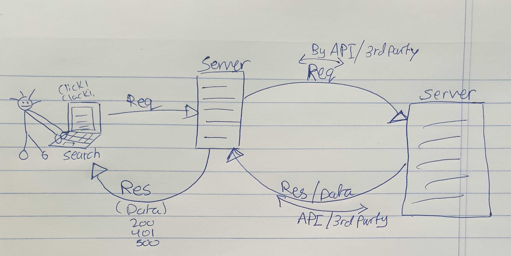

# Project (Movies-Library) - Version 1

**Author Name**: Sarah Hudaib

## Movies-Library WRRC

## Overview
Multi-task project, where i can build a movie app that can check the latest movies based on categories.

## Getting Started

 Ther are 2 steps that a user must take in order to build this app on their own machine and get it running:

# First Step: 
on the local machine you should run the following:

1. npm init -y   // creat node project
2. npm (i or install) express cors  // to add express & cors packages
3. add .gitignore // because thers alot of files inside the (node_modules) file that take alot of space and tim when i share my code with others so i need a place to put all the files that i dont want to share with others in the .gitignore file. 

# Second step:

1. to determine what the server possible scenarios that I should write inside the (server.js).
2. usually have 4 scenarios (get req, post, delete, edit).
3. put the data that i want from the user to reach

<!-- What are the steps that a user must take in order to build this app on their own machine and get it running? -->

# Project Features
<!-- What are the features included in you app -->
The code using a slightly code with a good documentation

## Movies-Library (API) WRRC

## Movies-Library (Data Base) WRRC

## Today on day 13 we will be able to:

1. Describe and Define: Database (DBMS,SQL,NoSQL), Relational Databases, Tables, Columns, Rows, Records, SQL Language
2. How CRUD relates to SQL
3. pg client library for Node
4. Connect a node server to a Postgres DB
5. Build a schema
6. Save (INSERT) records to the database
7. Read (SELECT) records from the database

## Today on day 14 we will be able to:

1. Create update and delete requests
2. Update (UPDATE) a record in the database
3. Delete (Delete) a record from the database
4. Read (SELECT) a record from the database

## The most common HTTP Status Codes:

Success codes HTTP status codes

1. 200 OK
2. 201 Created
3. 202 Accepted
4. 203 Non-authoritative Information
5. 204 No Content
6. 205 Reset Content

Client Error HTTP status codes

1. 400 Bad Request
2. 401 Unauthorized
3. 402 Payment Required
4. 403 Forbidden
5. 404 Not Found

Server Error HTTP status codes

1. 500 Internal Server Error
2. 501 Not Implemented
3. 502 Bad Gateway
4. 503 Service Unavailable
5. 504 Gateway Timeout
6.  505 HTTP Version Not Supported