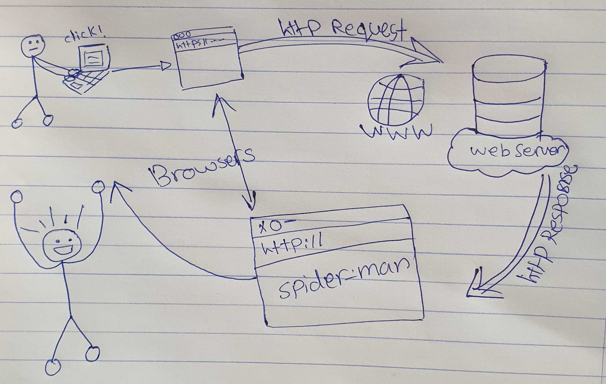

# Project (Movies-Library) - Version 1

**Author Name**: Sarah Hudaib

## Movies-Library WRRC

## Overview
Multi-task project, where i can build a movie app that can check the latest movies based on categories.

## Getting Started

 Ther are 2 steps that a user must take in order to build this app on their own machine and get it running:

# First Step: 
on the local machine you should run the following:

1. npm init -y   // creat node project
2. npm (i or install) express cors  // to add express & cors packages
3. add .gitignore // because thers alot of files inside the (node_modules) file that take alot of space and tim when i share my code with others so i need a place to put all the files that i dont want to share with others in the .gitignore file. 

# Second step:

1. to determine what the server possible scenarios that I should write inside the (server.js).
2. usually have 4 scenarios (get req, post, delete, edit).
3. put the data that i want from the user to reach

<!-- What are the steps that a user must take in order to build this app on their own machine and get it running? -->

# Project Features
<!-- What are the features included in you app -->
The code using a slightly code with a good documentation